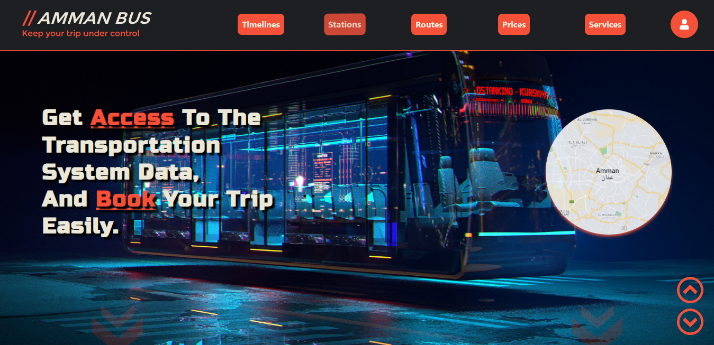
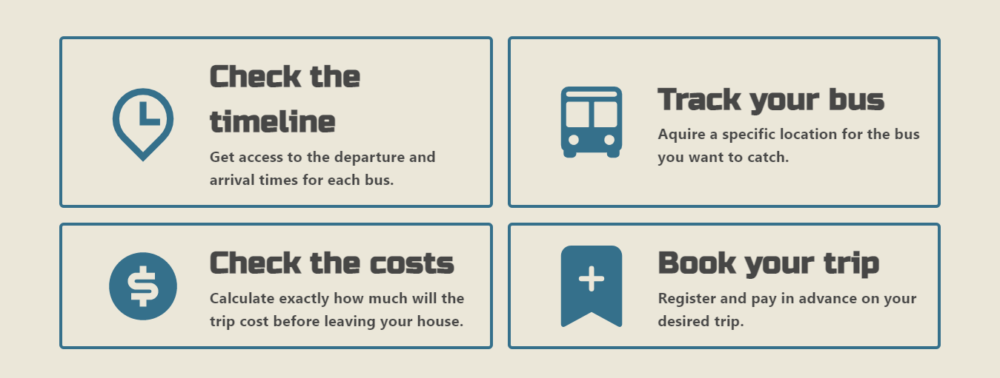
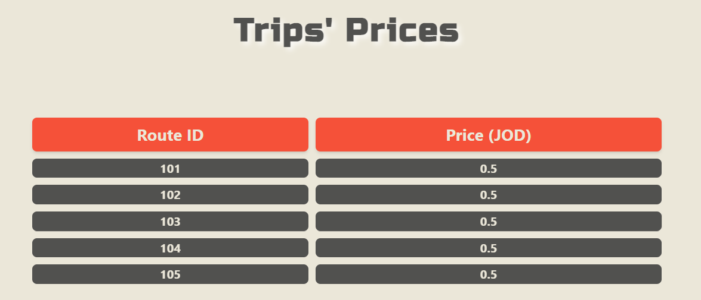
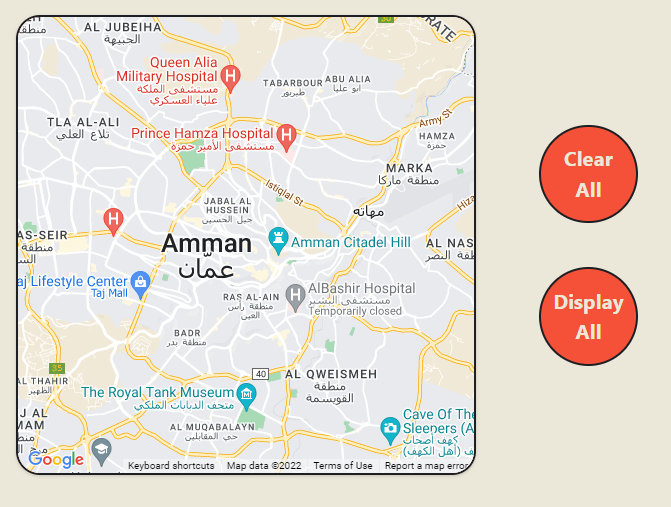
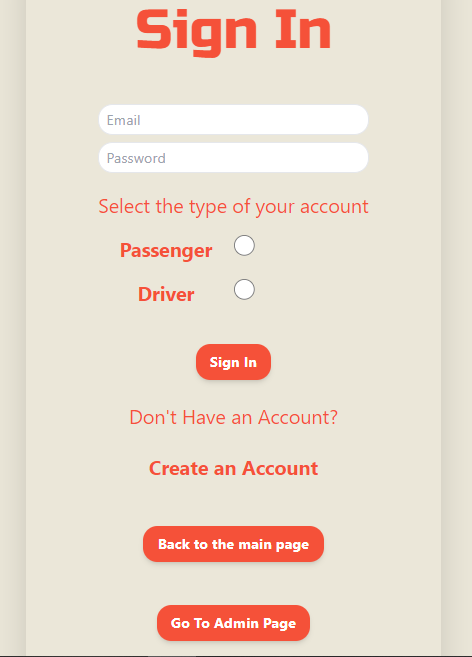
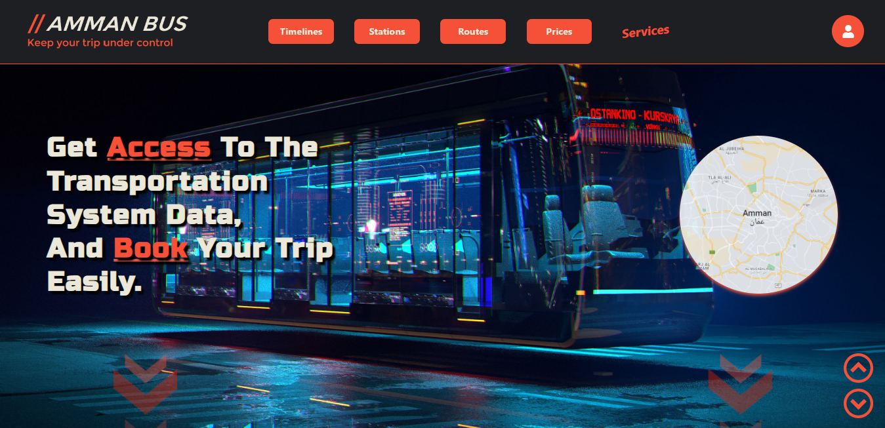
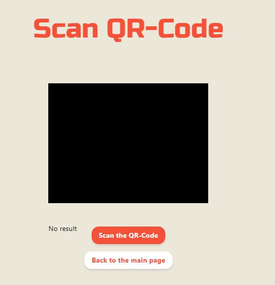

## **Amman Bus Management System Features and Interfaces**

 

- **Home Page**

    
    

    This page is the first to view when visiting the websites, and it allows guests to navigate through some of the functionalities the site offers, and those are:

     

    1. **Buses' Timelines**

        

        The guest will be able to keep track of different buses they choose from the map. Based on their IDs, what route they're on, when do they leave one station and when do they arrive at another, in addition to the buses's capacity and lastly the given ratings of passengers.

     

    2. **Buses's Stations**

        The guest will be able to keep track of different stations they choose from the map. Where they'll get the station's ID, their names, and what routes that passes through them.

     

    3. **Buses's Routes**

        The guest will be able to keep track of different routes they choose from the map.

        Finding out the route's ID, where do they start and end, the stations in the routes's way, and and how much time and distance it takes to cross them.

     

    4. **Trips' Prices**

        

        The guest will be able to learn how much money it costs to go on a bus trip based on which route they're on.

     

    5. **Map**

        

        The guest will be able to use the map to point to certain routes, or stations to learn more about them in the above features.

 

 

- **Accounts**

    To the very right of the Navbar, there is a drop down menu where the guest gets to either sign-in or sign-up, noting that the guests are only allowed to register or sign-up as passengers.

    

    As can be seen, when the button is pressed the guest is given only two options, and if clicked on either of them, the guest will be referred to another page.

     

    1. **Sign-up**

        

        In this page, the first time guest would be able to register only as a passenger by filling up a form.

     

    2. **Log-In**

        

        In this page, the already registered user will be able to sign-in into their account by providing the Email and Password.

        The user can be both, driver and passenger.

 

 

- **Interfaces**

    The interfaces are the exclusive pages that get rendered to authenticated users, each one is different from the other. And on our web site, there are only two interfaces:

    1. **Driver's Interface**

        After the driver is registered and signed-in into their account, they'll be re-directed to the home page where they'll gain access to a new feature, called *services*.

        

        And after clicking on *services* from the Navbar, the driver interface will show a feature to scan the QR-Code of the passengers, as a method of verification.

         

        

     
    
    2. **Passenger's Interface**

        Same as the driver's interface, the passenger's interface will be rendered after they're signed-in and after clicking on *services* button from the Navbar.

        Then the passenger's interface will show the following features:

        - **Plan Your Trip**: This feature enables the passenger to choose pick-up and drop-off stations directly from the map.

        - **Available Buses**: This feature lets the passenger choose a certain bus from the map, then show deatiled information about it.

        - **My Plan's QR-Code**: After confirming the plan, the passenger will be provided with a QR-Code as a verification method.
